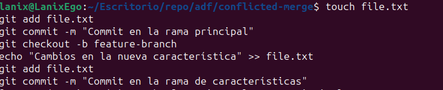
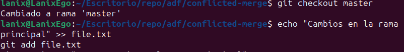
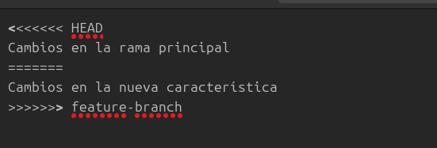
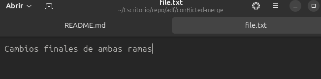
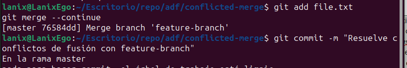
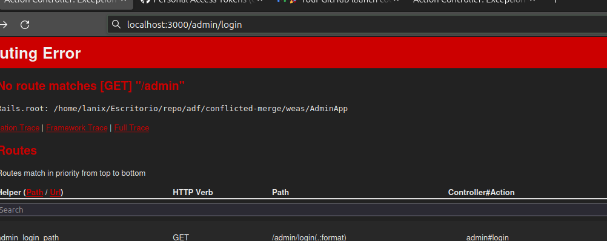
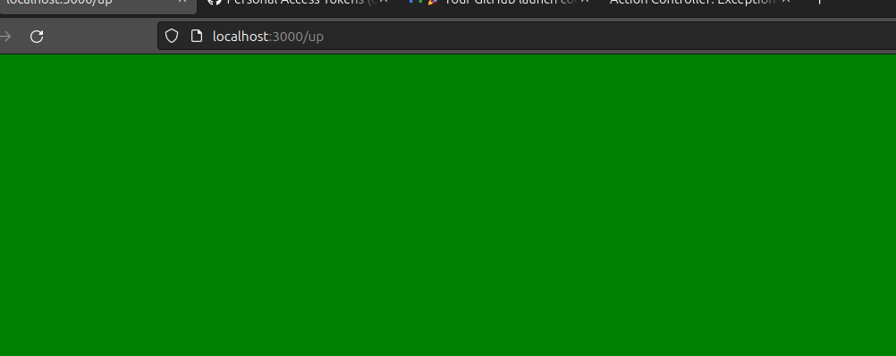
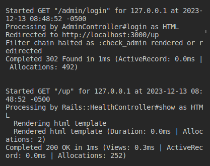
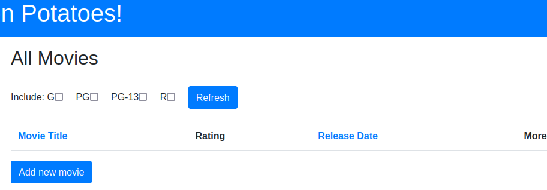

##Parte 1

1. Puedo generar el conflicto merge si en mi repositorio remoto tengo información diferente al de mi repositorio local, es decir en mi computadora. Para esto creo un repositorio, le agrego un readme, y en mi local agrego archivos sin realizar el pull de los archivos previos del repositorio

El conflicto de merge surgue cuando desde dos ramas distintas realizamos cambios a un archivo y a la hora de subirlo a la rama principal genera conflictos podemos solucionarlo con merge y se vería así

Cambios en la rama secundaria

Cambios en la rama principal 

Así se vería si queremos hacer el merge 

Modificamos 

Y listo 

2.

Si @user no tiene un nombre de usuario y llamamos a @user.valid?, el método valid? verificará las validaciones definidas en el modelo User. En este caso, la validación validates :username, :presence => true asegura que el campo username esté presente, por lo que si @user no tiene un nombre de usuario, @user.valid? devolverá false. Al llamar a @user.save, la operación de guardado también fallará, ya que save internamente verifica la validez del objeto antes de intentar guardarlo en la base de datos.

class User < ActiveRecord::Base
  validates :username, presence: true
  validate :username_format

  private

  def username_format
    unless username.blank? || /\A[a-zA-Z][a-zA-Z0-9]{0,9}\z/.match?(username)
      errors.add(:username, 'debe comenzar con una letra y tener como máximo 10 caracteres de largo')
    end
  end
end

Este método username_format verifica si el campo username cumple con los criterios establecidos, comienza con una letra y tiene que tener 10 caracteres maximo de largo

3.Recuerda, los filtros nos ayudan a verificar si ciertas condiciones se cumplen antes de permitir que se ejecute una acción del controlador. Para el modelo de User, digamos que queremos verificar si @user era administrador de todos los métodos en AdminController. Completa el método before_filter:check_admin a continuación que verifica si el campo de administrador en @user es verdadero. De lo contrario, redirija a la página admin_login con un mensaje que indica acceso restringido.

class AdminController < ApplicationController
  before_filter :check_admin

  private

  def check_admin
    unless @user && @user.admin?
      flash[:alert] = 'Acceso restringido. Debes ser un administrador.'
      redirect_to rails_health_check_path
    end
  end
end

before_filter :check_admin indica que el método check_admin se ejecutará antes de cada acción en el controlador AdminController.

check_admin es un método privado que verifica si @user existe y si el campo admin en @user es verdadero (@user.admin?). Si @user no existe o no es un administrador, se establece un mensaje de alerta en el flash (flash[:alert]) y se redirige a la página admin_login con el mensaje de acceso restringido.

para probarlo iremos a rails_health_check_path si no funciona el ingreso como administrador 

Nos redirige 

Se puede verificar por la consola 

4.

5.
Pdemos usar metaprgramación en dos sentidos

Eval
Podemos usar eval como metaprogramación y conseguir dinamismo en tiempo de ejecución, ya que nos permite evaluar o interpretar lo que el usuario nos ingresa
Bloques
Sirve para optimizar codigo estatico y conseguir dinamismo sea el caso de un constructor donde sobrecargamos metodos, consiguiendo una respuesta a los diferentes escenarios

Parte 2 Pruebas

Buscamos usar pruebas para mostar ....

